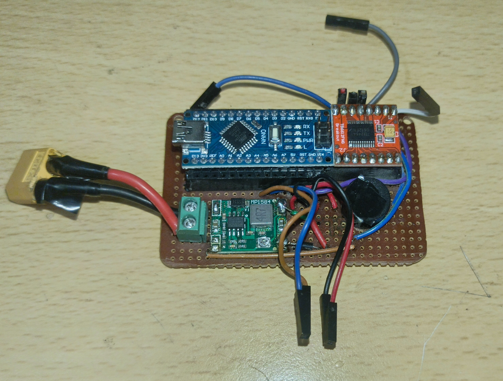

# Self-Balancing Reaction Wheel Pendulum

## Project Overview
This project is a self-balancing robot based on the **Reaction Wheel** concept. Unlike a 2-wheeled robot, this system uses a weighted flywheel mounted on top of a pendulum. By accelerating and decelerating the flywheel, the system generates reaction torque to counteract gravity and keep the pendulum upright.

The system is powered by an **Arduino**, an **MPU6050** IMU, and a **TB6612FNG** motor driver.

## Key Features
* **Sensor Fusion:** Uses a Complementary Filter (98% Gyro / 2% Accel) to calculate a stable pitch angle.
* **PID Control:** Implements a Proportional-Integral-Derivative controller with **Integral Anti-Windup** to prevent saturation.
* **Real-time Tuning:** PID constants ($K_p, K_i, K_d$) can be adjusted instantly via the Serial Monitor without re-uploading code.
* **Safety:** Includes deadband control and motor output constraining.

## Hardware Pinout
Based on the firmware configuration:

| Component | Pin Name | Arduino Pin | Description |
| :--- | :--- | :--- | :--- |
| **TB6612FNG** | PWMB | **D5** | PWM Speed Control |
| | BIN1 | **D3** | Direction Input 1 |
| | BIN2 | **D8** | Direction Input 2 |
| **MPU6050** | SDA | **A4** (Uno) | I2C Data |
| | SCL | **A5** (Uno) | I2C Clock |
| | VCC | 5V/3.3V | Power |
| | GND | GND | Ground |

> **Note:** The code uses Channel B of the motor driver. Ensure your motor is connected to BO1/BO2.

## How to Tune (Serial Commands)
This robot allows you to tune the stability while it is running. Open the **Arduino Serial Monitor** (Baud Rate: **115200**) and type the following commands:

| Command | Example | Description |
| :--- | :--- | :--- |
| **p[val]** | `p18.5` | Sets $K_p$ (Proportional Gain) |
| **i[val]** | `i0.10` | Sets $K_i$ (Integral Gain) |
| **d[val]** | `d0.9` | Sets $K_d$ (Derivative Gain) |
| **s[val]** | `s0` | Sets the Target Setpoint (0 is usually upright) |
| **r** | `r` | Resets the Integral error to 0 |
| **c** | `c` | Recalibrates MPU offsets (Hold robot still!) |
| **m** | `m` | Inverts Motor Direction |
| **g** | `g` | Inverts Gyro Direction |

### Tuning Guide
1.  Set **Ki** and **Kd** to 0. Increase **Kp** until the robot starts oscillating around the setpoint.
2.  Increase **Kd** to dampen the oscillations (stop the shaking).
3.  Increase **Ki** slightly if the robot balances but leans to one side (steady-state error).

## Visuals
### The Robot

### Circuit Board
| Front View | Back View |
| :---: | :---: |
|  |  |

## Dependencies
* `Wire.h` (Standard Arduino Library)
